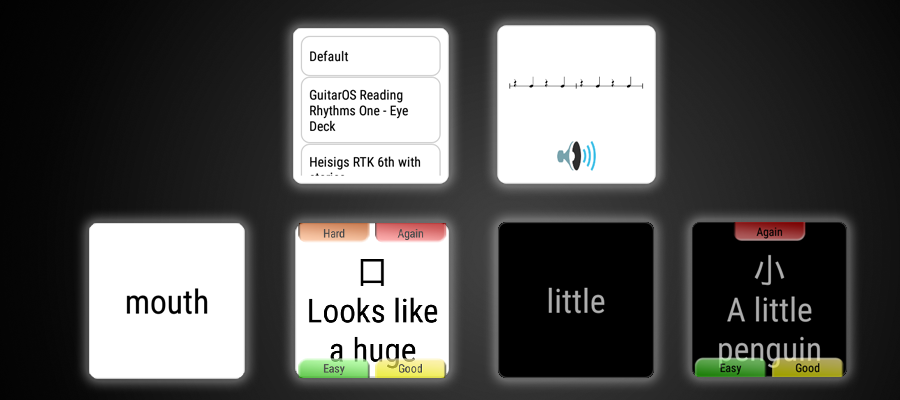

# AnkiWear
brings Anki to your wrist! 
 
 

 
 
 

## Features
 - Learn cards
 - Choose the deck to learn cards from
 - Audio and image file support
 - Day / Night mode
 - Card flip animation (can be disabled in settings)
 - Adjustable font size
 - Re-show question from answer screen by single/double tapping (can be configured in settings)
 - Additional delay for screen timeout (can be adjusted in settings)

## Installation
>Note: This app only works in combination with the AnkiDroid app. You can find further info about it here: https://play.google.com/store/apps/details?id=com.ichi2.anki

You can simply download and install the newest stable version from the Google Play Store: https://play.google.com/store/apps/details?id=com.yannik.wear.anki

## Pre-Releases
There are two methods to get pre-releases of AnkiWear. The first method is to become a google play alpha tester. This way new updates will automatically be installed on your device, as you are used to by normal apps.  
The second method is to manually download and install the releases. You will have to do this manually after every release, but the benefit is, that you don't have to wait for Google Play to publish the update (which can take up to a day)

### Method 1 - Use the Google Play alpha channel
- Become an AnkiWear alpha tester: https://play.google.com/apps/testing/com.yannik.wear.anki
- Download the AnkiWear app from the Google Play store

### Method 2 - Directly download the .apk files
This app only works with the development version of the AnkiDroid app
- Download and install the latest release of AnkiWear here: https://github.com/wlky/AnkiDroid-Wear/releases
- After a couple of seconds this should also automatically install the "Anki" app on your watch
